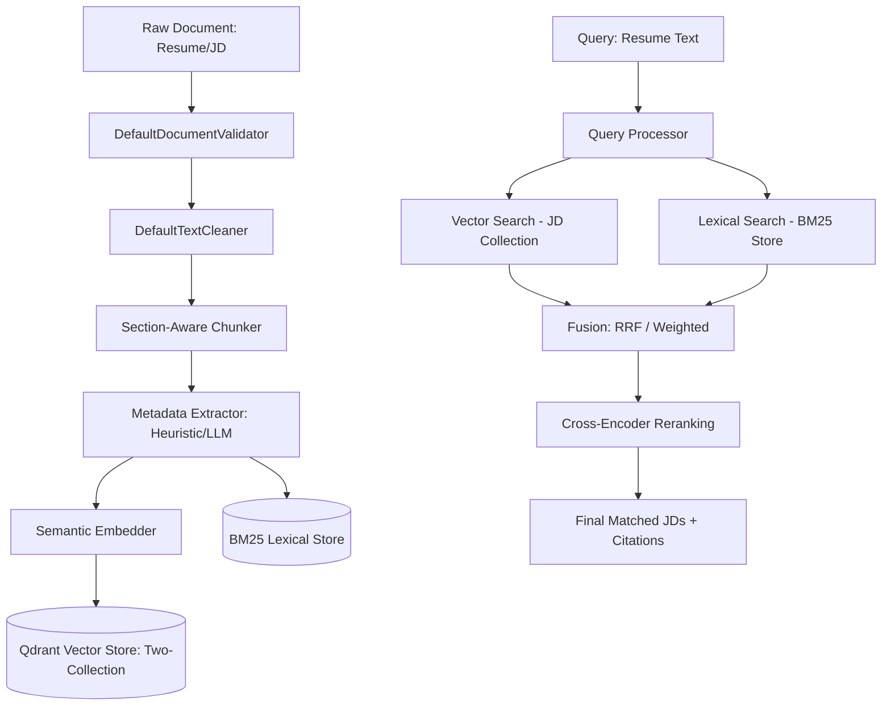

# Intelligent Recruiter Agent 6️⃣7️⃣😭

## Overview
An AI-powered recruitment agent that matches candidates to job descriptions using a Zero-Hallucination RAG pipeline, hybrid retrieval, and advanced data processing. The system implements a two-collection Qdrant architecture to keep resumes and job descriptions separate, combining semantic vector search with BM25 lexical search and Reciprocal Rank Fusion (RRF) to produce highly precise matching results.

## Team
- Member 1 — Data Pipeline (Ingestion, Validation, Section-Aware Chunking, Metadata Extraction)
- Member 2 — Retrieval + Reranking (Vector Search, BM25, Fusion, Cross-Encoder Reranking)
- Member 3 — API Layer & Orchestration (FastAPI Web Service & Lifespan Hooks)
- Member 4 — UI, Testing, & Observability (Streamlit Dashboard, Pytest Suite, Prometheus Metrics)

## Tech Stack
- Python 3.12
- FastAPI (REST API layer)
- Qdrant (Vector search DB, supporting `:memory:` local testing & remote server deployment)
- Hugging Face Sentence Transformers (Semantic embeddings & Cross-Encoder reranking)
- rank-bm25 (Lexical store indexing & search)
- Pytest & Pytest-asyncio (Unit, Integration, and System testing)
- Pydantic v2 (Data validation & schemas)
- Prometheus (Performance monitoring & metrics)

## Architecture


The system separates files into two distinct paths:
1. **Ingestion Pipeline**: Processes, validates, cleans, chunks (using regex section-aware headers), extracts key metadata, embeds, and indexes documents into both the BM25 Lexical Store and Qdrant Vector Store.
2. **Retrieval Pipeline**: Performs hybrid search across both vector and lexical backends, merges results using Reciprocal Rank Fusion (RRF) or Weighted Score Fusion, and optionally re-ranks the candidate matches using a Cross-Encoder model.

## Setup Instructions

For a comprehensive, step-by-step setup and demo guide, see [RUN_GUIDE.md](file:///c:/Users/Damien/OneDrive/Desktop/AIC-Hackathon/RUN_GUIDE.md).

### 1. Create and Activate Virtual Environment
```bash
# From project root:
python -m venv .venv

# On Windows:
.\zero-hallucination-rag\.venv\Scripts\activate
```

### 2. Install Libraries
```bash
cd zero-hallucination-rag
pip install -r requirements.txt
```

### 3. Configure Environment
Verify that your `.env` file exists in the `zero-hallucination-rag/` directory and has the required `CHUTES_API_KEY` defined:
```bash
# E.g., make sure it is configured inside zero-hallucination-rag/.env
```

### 4. Run Qdrant Vector Store
Start Qdrant via Docker (required for vector search):
```bash
docker run -p 6333:6333 -p 6334:6334 qdrant/qdrant
```

### 5. Run Application Backend
Run the FastAPI web backend:
```bash
uvicorn api.main:app --reload
```
Access the Swagger API documentation at `http://localhost:8000/docs`.

### 6. Run Streamlit UI
Start the premium recruitment frontend in a new terminal window:
```bash
streamlit run ui/app.py
```
Access the dashboard at `http://localhost:8501`.

### 7. Run the Codebase Visualizer
Launch the interactive codebase knowledge graph visualizer from the project root directory:
```bash
npx understand-anything serve
```

### 8. Run the Test Suite
To verify the system end-to-end and run the 39 tests:
```bash
python -m pytest tests/
```

## How It Works
1. **Ingest Resumes & Job Descriptions**: Resumes and JDs are uploaded via `POST /ingest/resume` and `POST /ingest/jd`. They are validated (ensuring they are PDF/DOCX), cleaned, and segmented by section headers (e.g. Work Experience, Education, Skills).
2. **Indexing**: Chunks are embedded and indexed into separate collections in Qdrant (a `resumes` collection and a `job_descriptions` collection) and indexed in BM25.
3. **Match Retrieval**: A request to `POST /match` evaluates a candidate's resume against all ingested JDs by querying the JD database collection using hybrid vector and keyword search.
4. **Fusion & Reranking**: Results are fused using reciprocal rank fusion (RRF) and re-ranked using a Cross-Encoder to return the top matching JDs.
5. **Citations & Verification**: Citations are generated back to the source document chunks, ensuring zero hallucination.

## Project Structure
zero-hallucination-rag/
├── ingest/
├── retrieval/
├── agent/
├── ui/
├── cache/
├── observability/
├── evals/
├── data/
├── .env
├── requirements.txt
└── README.md

## References
- [FastAPI Documentation](https://fastapi.tiangolo.com/)
- [Qdrant Vector DB Documentation](https://qdrant.tech/documentation/)
- [LangChain Documentation](https://python.langchain.com/)
- [ChromaDB Documentation](https://docs.trychroma.com/)
- [Direct Corpus Interaction Paper (DCI)](https://arxiv.org/)
- [Chutes AI Documentation](https://chutes.ai/)
- [Hermes CLI Documentation](https://hermes.dev/)

