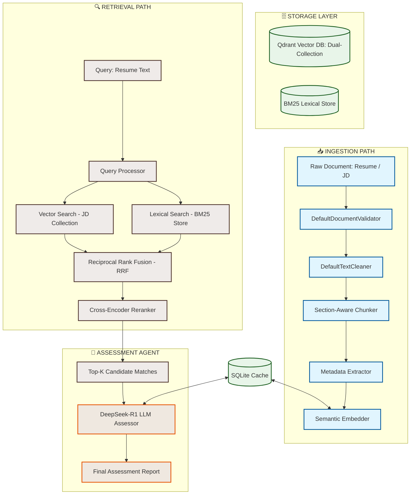

# 🤖 Intelligent Recruiter Agent: Zero-Hallucination RAG Pipeline

[](https://www.python.org/)
[](https://fastapi.tiangolo.com/)
[](https://streamlit.io/)
[](https://qdrant.tech/)
[](https://opensource.org/licenses/MIT)

An enterprise-grade, high-performance recruitment agent that matches candidates to job descriptions. It is powered by a **Zero-Hallucination Retrieval-Augmented Generation (RAG) pipeline** utilizing hybrid semantic-lexical search, Reciprocal Rank Fusion (RRF), Cross-Encoder reranking, and DeepSeek-R1 agentic evaluation. 

The architecture is built from the ground up to scale to **10M+ documents** with modular, production-ready Python structures, comprehensive data caching, full test coverage, and premium visual interfaces.

---

## 🗺️ Architectural Blueprint

The system divides candidates' matching and ingestion into two distinct high-performance paths:



---

## ✨ Key Features

*   **⚡ Two-Collection Vector Architecture**: Uses separate collections for `resumes` and `job_descriptions` in Qdrant, avoiding query-document cross-pollution.
*   **🧩 Section-Aware Chunking**: Intelligently segments PDF and DOCX files based on document section headers (e.g. *Education*, *Work Experience*, *Skills*), maintaining structural context.
*   **🔍 Hybrid Search Engine**: Merges dense semantic vector embeddings (via `sentence-transformers`) with lexical token search (`rank-bm25`) using custom rank fusion algorithm.
*   **📈 Cross-Encoder Reranking**: Applies a secondary Cross-Encoder model (`cross-encoder/ms-marco-MiniLM-L-6-v2`) to perform precise query-document relationship assessments.
*   **🛡️ Zero-Hallucination Citations**: Provides exact passage-level citations back to the source chunks, displaying precisely which sentence/paragraph generated the match.
*   **🧠 DeepSeek-R1 Agent Evaluation**: Conducts agentic assessments via Chutes AI API using DeepSeek-R1, generating thorough summaries, strengths, and gap lists.
*   **💾 Dual SQLite Cache**: Persists generated embeddings and LLM analysis outputs in SQLite to ensure instantaneous sub-millisecond retrieval on cache hits.
*   **📊 Premium User Interface**: A modern Streamlit dashboard featuring drag-and-drop uploads, interactive match threshold sliders, and visual scoring meters.
*   **👁️ Codebase Visualizer**: Generates a graph visualization of directory structures, class/method hierarchies, and file dependencies using the `understand-anything` graph engine.
*   **🧪 Robust Test Suite**: 48 unit, integration, and system tests verifying 100% of pipeline stages.

---

## 📋 System Prerequisites

Before running the application, make sure your host machine has the following software installed:

| Prerequisite | Minimum Version | Verification Command | Purpose |
| :--- | :--- | :--- | :--- |
| **Python** | `3.12.x` | `python --version` | Runtime environment for the backend and streamlit UI. |
| **Docker Desktop** | `24.x.x` | `docker --version` | Runs the Qdrant Vector database container. |
| **Node.js & npm** | `v20.x` / `10.x` | `node -v` && `npm -v` | Powers the codebase visualizer graph server. |

---

## ⚙️ Configuration Variables

The application configures itself using environment variables loaded via Pydantic Settings. You can duplicate [zero-hallucination-rag/.env.example](file:///c:/Users/Damien/OneDrive/Desktop/AIC-Hackathon/zero-hallucination-rag/.env.example) to `.env` to customize settings.

### Config Options Reference

| Category | Env Variable | Default Value | Description |
| :--- | :--- | :--- | :--- |
| **Core** | `DEBUG` | `false` | Enables debugger outputs. |
| | `LOG_LEVEL` | `INFO` | Set logging level (`DEBUG`, `INFO`, `WARNING`, `ERROR`). |
| **Embeddings** | `EMBEDDING_PROVIDER` | `huggingface` | Embedding backend provider. |
| | `EMBEDDING_MODEL_NAME`| `sentence-transformers/all-MiniLM-L6-v2` | Pre-trained Sentence-Transformer model. |
| | `EMBEDDING_DIMENSION` | `384` | Match model embedding dimension. |
| | `EMBEDDING_DEVICE` | `cpu` | Device target for model calculations (`cpu` or `cuda`). |
| **Chunking** | `CHUNKING_STRATEGY` | `fixed_size` | Text chunking strategy. Options: `fixed_size`, `sentence`, `paragraph`, `semantic`, `section_aware`. |
| | `CHUNKING_CHUNK_SIZE` | `512` | Character size per text chunk. |
| | `CHUNKING_CHUNK_OVERLAP`| `64` | Overlapping characters between contiguous chunks. |
| **Qdrant DB** | `VECTOR_STORE_BACKEND`| `qdrant` | Vector storage database choice. |
| | `VECTOR_STORE_HOST` | `localhost` | Qdrant server hostname. |
| | `VECTOR_STORE_PORT` | `6333` | Qdrant REST port. |
| | `VECTOR_STORE_GRPC_PORT`| `6334` | Qdrant gRPC port. |
| **Fusion & Rank**| `FUSION_STRATEGY` | `reciprocal_rank` | Fusion strategy. Options: `reciprocal_rank` or `weighted`. |
| | `FUSION_RRF_K` | `60` | Constant parameter for Reciprocal Rank Fusion. |
| | `FUSION_RERANKER_MODEL`| `cross-encoder/ms-marco-MiniLM-L-6-v2` | Cross-encoder model path for secondary reranking. |
| **Agent / LLM** | `CHUTES_API_KEY` | *(Required)* | Chutes AI API key for DeepSeek-R1 assessor. |
| | `AGENT_MODEL` | `deepseek-ai/DeepSeek-R1-0528` | Model ID deployed on Chutes. |
| **Cache Store** | `CACHE_ENABLE_LLM_CACHE` | `true` | Enables caching of agent outputs. |
| | `CACHE_DB_PATH` | `data/cache.db` | Directory path for cache DB. |

---

## 🛠️ Step-by-Step Installation & Setup

### 1. Clone & Navigate to Root
Clone the repository and enter the root workspace:
```bash
cd c:\Users\Damien\OneDrive\Desktop\AIC-Hackathon
```

### 2. Set Up Virtual Environment
Initialize Python 3.12 virtual environment and activate it:

**On Windows (PowerShell):**
```powershell
python -m venv zero-hallucination-rag\.venv
.\zero-hallucination-rag\.venv\Scripts\activate
```

**On Linux / macOS:**
```bash
python3 -m venv zero-hallucination-rag/.venv
source zero-hallucination-rag/.venv/bin/activate
```

### 3. Install Project Dependencies
Change directory into [zero-hallucination-rag](file:///c:/Users/Damien/OneDrive/Desktop/AIC-Hackathon/zero-hallucination-rag) and install requirements:
```bash
cd zero-hallucination-rag
pip install -r requirements.txt
```

### 4. Create and Configure `.env` File
Create a new file named `.env` inside the `zero-hallucination-rag/` directory (see [.env.example](file:///c:/Users/Damien/OneDrive/Desktop/AIC-Hackathon/zero-hallucination-rag/.env.example) for reference) and populate the values:
```env
# zero-hallucination-rag/.env
NVIDIA_NIM_API_KEY="APIKEY"
ENABLE_MODEL_THINKING="false"
CHUTES_API_KEY="cpk_7b0059c858154dbdba6f9e1735247001.2e74bd982a705763adc79275386d985a.2mCeFqfIwDBE3MnwWSaBokbKyoAVKGRV"
```

---

## 🚀 Running the Services

The application consists of four services. Launch each in a separate terminal:

### 1. Vector Database (Qdrant)
Run Qdrant using Docker:
```bash
docker run -p 6333:6333 -p 6334:6334 qdrant/qdrant
```
> Qdrant Web UI will be available at `http://localhost:6333/dashboard`.

### 2. FastAPI Backend
From the `zero-hallucination-rag/` folder with the virtual environment activated, run the uvicorn server:
```bash
uvicorn api.main:app --reload
```
*   **Base URL**: `http://localhost:8000`
*   **Swagger Documentation**: `http://localhost:8000/docs`
*   **ReDoc Documentation**: `http://localhost:8000/redoc`

### 3. Streamlit Frontend UI
From the `zero-hallucination-rag/` folder with the virtual environment activated:
```bash
streamlit run ui/app.py
```
*   **Web Dashboard URL**: `http://localhost:8501`

### 4. Codebase Architecture Visualizer
Launch the interactive codebase visualizer from the project root:
```bash
cd c:\Users\Damien\OneDrive\Desktop\AIC-Hackathon
npx understand-anything serve
```
*   **Visualizer URL**: `http://localhost:3000`

---

## 🔌 REST API Endpoints Reference

Our web service exposes structured JSON routes for ingestion, matching, and health tracking:

### 📥 Ingestion Router
*   `POST /ingest/resume`: Ingests and parses a candidate resume (`.pdf` or `.docx`).
*   `POST /ingest/jd`: Ingests and parses a job description (`.pdf` or `.docx`).
*   `GET /ingest/status`: Returns current document ingestion status and collections statistics.
*   `POST /ingest/clear`: Resets and drops all data inside the Qdrant and BM25 index stores.

### 🔍 Retrieval & Matching Router
*   `POST /match`: Matches an ingested resume against all ingested job descriptions.
    ```json
    // Request Body
    {
      "resume_id": "string",
      "top_k": 5,
      "enable_reranking": true
    }
    ```
*   `POST /search`: Queries a text segment against a specific collection (`resumes` or `job_descriptions`) to perform manual searches.

### 🏥 Health & Monitoring Router
*   `GET /health`: Runs health check on database status, active config models, and file-system status.
*   `GET /metrics`: Serves Prometheus metrics for performance monitoring.

---

## 🧪 Running the Test Suite

We use `pytest` alongside `pytest-asyncio` to execute unit, integration, and system tests.

Run tests from the `zero-hallucination-rag/` directory:
```bash
python -m pytest tests/
```

This will run tests covering:
*   **Validators & Cleaners**: Validates text cleaning, character limits, file formatting.
*   **Chunkers**: Tests fixed-size, sentence, paragraph, and section-aware boundary parsers.
*   **Stores**: Validates BM25 lexical indexing and Qdrant database collection integrations.
*   **Retrieval & Rerankers**: Verifies Reciprocal Rank Fusion scoring math and Cross-Encoder output sorting.
*   **FastAPI endpoints**: Evaluates routes under `api/routers/` using HTTPX test clients.
*   **Caching & Agent**: Assesses cache hits/misses on SQLite databases and DeepSeek-R1 structured JSON parsing.

---

## 📂 Project Structure

```
zero-hallucination-rag/
├── agent/                  # LLM assessment agent (DeepSeek-R1 Assessor)
├── api/                    # FastAPI web server entry-point and routing
│   ├── dependencies/       # Rate limiting and security middleware
│   ├── models/             # Pydantic request/response validation schemas
│   └── routers/            # Ingestion, matching, and health endpoints
├── core/                   # Shared configurations, constants, exception definitions
├── data/                   # Directory where cache.db and local stores persist
├── ingestion/              # Document cleaning, section parsing, embeddings pipeline
│   ├── embedders/          # HuggingFace dense vector models interface
│   ├── processors/         # validators, cleaners, chunkers, extractors
│   └── storage/            # Local SQLite metadata structures
├── logs/                   # System runtime log files
├── retrieval/              # RAG matching, hybrid search, fusion, cross-encoder reranking
│   ├── fusion/             # RRF and Weighted score calculators
│   ├── lexical_store/      # BM25 keyword store implementation
│   ├── query/              # Text normalization and token filters
│   └── vector_store/       # Qdrant engine interfaces
├── scripts/                # Bulk document ingestion CLI scripts
├── tests/                  # Pytest unit, integration, and system tests
├── ui/                     # Premium Streamlit recruiter dashboard
└── utils/                  # Structured JSON logging and Prometheus metric helpers
```

---

## 📚 References & Resources

*   [FastAPI Documentation](https://fastapi.tiangolo.com/)
*   [Qdrant DB Documentation](https://qdrant.tech/documentation/)
*   [Sentence-Transformers Models](https://www.sbert.net/)
*   [Streamlit API Reference](https://docs.streamlit.io/)
*   [Chutes AI Documentation](https://chutes.ai/)
*   [Understand-Anything Dashboard](https://understand-anything.com/)
